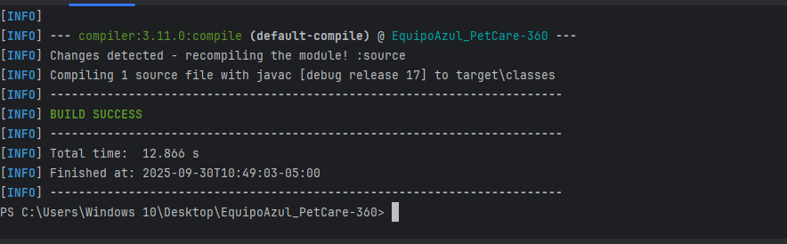
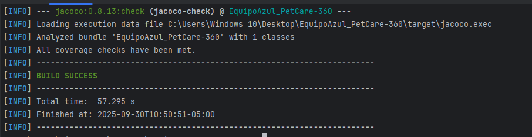
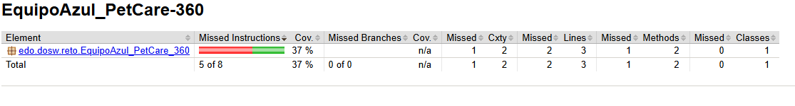
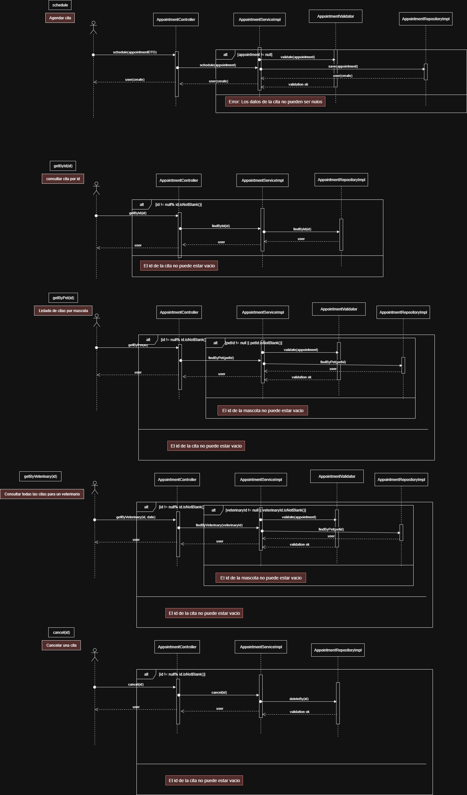
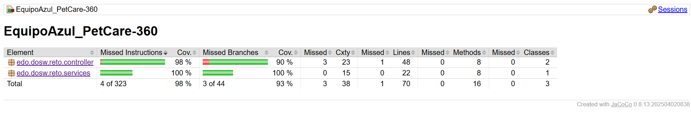
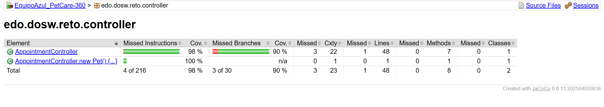
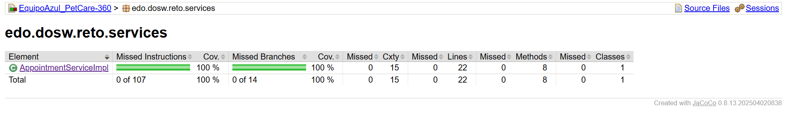
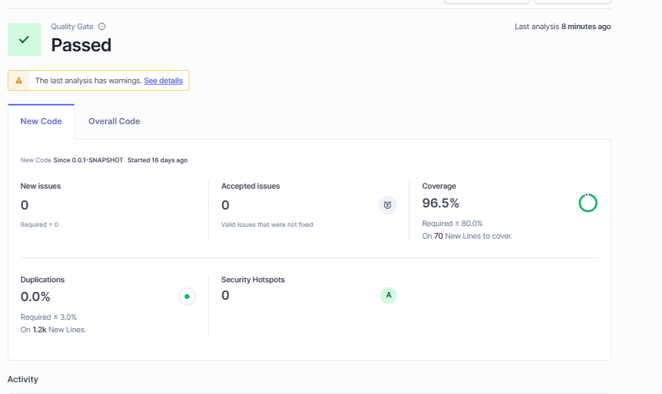

# EquipoAzul_PetCare-360

## Tecnologías y Dependencias
- Java 17
- Spring Boot
- Maven
- Lombok
- Swagger UI
- JUnit 5
- Jacoco
- SonarQube
### Pruebas iniciales

---
## Estrategia de Ramas – GitFlow

Para mantener un flujo de trabajo organizado y colaborativo:

### Ramas 
- **main**: Rama estable que siempre contiene la version de produccion del proyecto.
- **develop**: Rama de desarrollo donde se integran todas las funcionalidades antes de ser liberadas a main.
- **feature/DiagramasUML**: Rama para Implementar los Diagramas Solicitados en el enunciado
- **feature/agendar-citas**: Rama que implementa toda la logica para programar una cita.
- **feature/consultar-cita**: Rama que implementa toda la logica para consultyar una cita por su Id.
- **feature/mascotas-citas**: Rama que implementa toda la logica para listar todas las citas que tengan cada mascota.
- **feature/veterinario-cita**: Rama que implementa toda la logica para listar todas las citas de un veterinario.
- **feature/cancelar-citas**: Rama que implementa toda la logica para cancelar una cita existente

### Estructura Commit
commit -m "Semana #: Primer Nombre y apellido - la acción realizada"

Este sera el commit utilizado para todo el proyecto del Equipo Azul

---
## Diagrama de contexto

El diagrama de contexto muestra el  sistema PetCare-360 y sus relaciones con los actores externos
que interactúan con el. PetCare-360 centraliza en la gestion de servicios de las veterinarias,
aplica las reglas de negocio definidas por la empresa.

- Cliente: Son los encargados de registrar a sus mascotas, consultan los servicios disponibles, agendan las citas y adquieren productos de la empresa.

- Veterinaria: Las entidades se prestan para proveer la disponibilidad de sus citas, sus tratamientso, sus productos y envia todo lo relacionado con la historia clinica.

## Diagrama de casos de Uso

En este diagrama se definieron que acciones puede hacer cada actor en este caso Cliente es todo lo relacionado con usar el servicio del cuidado de las mascota
y en Veterinaria todo lo relacionado en proveer el servicio para el cuidado de la masota

## Funcionalidades

### Actor: Cliente

El **Cliente** puede acceder a la plataforma para gestionar sus mascotas, servicios veterinarios y compras de productos.  
A continuación se detallan sus funcionalidades:

- F1. Consultar productos
  - Visualizar catálogo de productos (alimentos, medicamentos, accesorios).
  - Filtrar por tipo, precio o disponibilidad.
  - Ver descripción detallada y precio de cada producto.

- F2. Llevar mascotas
  - Registrar que una mascota ha sido llevada físicamente a la veterinaria.
  - Asociar el registro a una cita o atención médica.

- F3. Consultar historial clínico de la mascota
  - Visualizar el historial médico completo de una mascota.
  - Revisar diagnósticos, tratamientos y fechas de atención.
  - Descargar o imprimir el historial clínico.

- F4. Solicitar citas
  - Iniciar solicitud de cita médica para una mascota.
  - Seleccionar servicio, veterinario y fecha disponible.
  - Incluye las siguientes subfuncionalidades:
      - F4.1 Agendar cita: confirmar fecha, hora y veterinario asignado.
      - F4.2 Cancelar cita: eliminar una cita programada.
      - F4.3 Reprogramar cita: cambiar la fecha o el horario de una cita existente.

- F5. Consultar disponibilidad de citas
  - Ver horarios disponibles según el servicio o veterinario.
  - Filtrar por día, hora o tipo de atención.

- F6. Consultar servicios
  - Consultar la lista de servicios ofrecidos por la veterinaria.
  - Ver precios, descripción y duración estimada.

- F7. Consultar factura
  - Revisar facturas de servicios y compras anteriores.
  - Descargar comprobantes de pago en formato digital.

---

### Actor: Veterinaria

- F8. Registrar mascotas ingresadas
  - Ingresar información de nuevas mascotas atendidas.
  - Asociar cada mascota al cliente correspondiente.
  - Registrar motivo de ingreso o tipo de atención.

- F9. Consultar mascotas ingresadas
  - Buscar mascotas por nombre o propietario.
  - Consultar información médica o citas activas.

- F10. Asignar citas
  - Programar citas en los espacios disponibles.
  - Confirmar veterinario, fecha y tipo de servicio.
  - Evitar duplicidad de horarios.

- F11. Generar facturas
  - Calcular el valor total del servicio o producto.
  - Registrar el pago y generar comprobante electrónico.
  - Asociar factura con cliente y mascota atendida.
 
- F12. Generar historial clínico
  - Crear o actualizar historial médico tras una cita.
  - Incluye:
      - F12.1 Registrar diagnóstico: registrar los resultados de la consulta médica.
      - F12.2 Registrar tratamiento: prescribir medicamentos o cuidados posteriores.

- F13. Consultar disponibilidad de citas
  - Ver agenda general y disponibilidad de veterinarios.
  - Modificar horarios según requerimientos del centro.

- F14. Consultar historial clínico de la mascota
  - Acceder al historial completo de una mascota.
  - Editar o agregar observaciones clínicas.

- F15. Proporcionar productos
  - Registrar venta o entrega de productos al cliente.
  - Actualizar el inventario en tiempo real.
  - Asociar venta con factura correspondiente.

- F16. Consultar servicios solicitados
  - Ver servicios pendientes o en curso.
  - Filtrar por cliente, mascota o tipo de atención.

- F17. Consultar facturas
  - Visualizar facturas emitidas por fecha o cliente.
  - Modificar estado (pagada, pendiente o anulada).

---
## Historias de usuario

###  Cliente

- Como **Cliente**, quiero consultar productos para conocer qué ofrece la veterinaria.
- Como **Cliente**, quiero llevar mis mascotas para que reciban atención médica.
- Como **Cliente**, quiero consultar el historial clínico de mi mascota para conocer diagnósticos y tratamientos anteriores.
- Como **Cliente**, quiero solicitar citas para que mi mascota reciba atención en un horario definido.
- Como **Cliente**, quiero agendar una cita para asegurar un espacio en la veterinaria.
- Como **Cliente**, quiero cancelar una cita para liberar el espacio si no puedo asistir.
- Como **Cliente**, quiero reprogramar una cita para elegir una nueva fecha si surge un imprevisto.
- Como **Cliente**, quiero consultar la disponibilidad de citas para seleccionar una fecha y hora adecuada.
- Como **Cliente**, quiero consultar los servicios disponibles para saber qué atención puede recibir mi mascota.
- Como **Cliente**, quiero consultar mi factura para conocer los pagos pendientes o realizados.
- Como **Cliente**, quiero consultar mi cita para conocer qué dia tengo que llevar a mi mascota.

### Veterinaria

- Como **Veterinaria**, quiero registrar mascotas ingresadas para llevar un control de los animales atendidos.
- Como **Veterinaria**, quiero consultar mascotas ingresadas para verificar la información registrada.
- Como **Veterinaria**, quiero asignar citas para organizar la atención de los clientes.
- Como **Veterinaria**, quiero generar facturas para registrar los pagos de los servicios prestados.
- Como **Veterinaria**, quiero generar el historial clínico de la mascota para documentar diagnósticos y tratamientos.
- Como **Veterinaria**, quiero registrar un diagnóstico para dejar constancia del estado de salud de la mascota.
- Como **Veterinaria**, quiero registrar un tratamiento para indicar los pasos a seguir en la recuperación de la mascota.
- Como **Veterinaria**, quiero consultar la disponibilidad de citas para gestionar la agenda de atención.
- Como **Veterinaria**, quiero consultar el historial clínico de la mascota para dar seguimiento a su estado de salud.
- Como **Veterinaria**, quiero proporcionar productos para cubrir las necesidades del cliente y la mascota.
- Como **Veterinaria**, quiero consultar los servicios solicitados para verificar la atención prestada.
- Como **Veterinaria**, quiero consultar facturas para llevar el control contable.
- Como **Veterinaria**, quiero consultar citas para conocer qué dia tengo que recibir mascotas.

## Diagrama de clases

## Patrones de Diseño aplicados

- **Factory Method**  
  Usado para crear diferentes tipos de mascotas mediante una clase llamada PetFactory.

- **Strategy**  
  Implementado en el manejo de tratamientos o diagnósticos, que pueden variar según la especie del animal.

---

##  Principios SOLID en el diseño

- **S – Single Responsibility Principle (SRP)**  
  Cada clase tiene una única responsabilidad dentro del dominio.  
  *Ejemplo:* PetFactory solo crea mascotas, no las registra ni las trata.

- **O – Open/Closed Principle (OCP)**  
  Las clases están cerradas para modificación pero abiertas para extensión.  
  *Ejemplo:* se pueden agregar nuevos tipos de mascotas sin modificar la lógica existente en PetFactory.

- **L – Liskov Substitution Principle (LSP)**  
  Las subclases deben comportarse como su superclase sin alterar la funcionalidad del sistema.  
  *Ejemplo:* Dog extends Pet y Cat extends Pet funcionan de manera consistente como Pet.

- **I – Interface Segregation Principle (ISP)**  
  Cada interfaz define solo lo necesario, sin obligar a implementar métodos inútiles.  
  *Ejemplo:* cada TreatmentStrategy implementa su propia interfaz sin heredar métodos que no aplica.

- **D – Dependency Inversion Principle (DIP)**  
  El código del dominio depende de abstracciones y no de implementaciones concretas.  
  *Ejemplo:* los servicios trabajan sobre interfaces de repositorio y estrategias de tratamiento, no sobre clases fijas.
---
## Diagrama de secuencia

Se implementó el flujo completo de los métodos correspondientes a la gestión de citas, abarcando desde el controlador hasta el repositorio.

En el diagrama se representa el proceso de agendamiento de una cita, consulta de una cita existente, listado de citas por mascota y listado de citas por veterinario.

En estos flujos se observa cómo el controlador delega la lógica al servicio de citas, el cual, según el caso, realiza las validaciones necesarias a través del validador o bien transfiere directamente la operación al repositorio.

Cabe destacar que, dado que el proyecto no incluye persistencia en una base de datos MongoDB, las operaciones se simulan sin conexión real a la base de datos.

---
## Cobertura de pruebas
### Jacoco

Se observa que la implementacion de los test cubren una covertura superior a la definida que era 
del 85% donde solo se filtraron solo las pruebas para los controlladores y servios.
### sonarqube

En sonarqube se limita las clases que cubre sonarqube para que no baje la cobertura con clases que no necesitan ningun test.

En este caso se limito todo menos el controllador y el servicio ya que son las unicas a las que se les implementa Test

---
## Pruebas de API REST 

### Gestion de citas sin persistencia

https://www.youtube.com/watch?v=4Ys7kaesiZ0

---