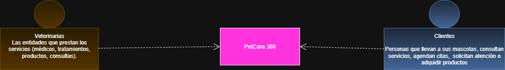
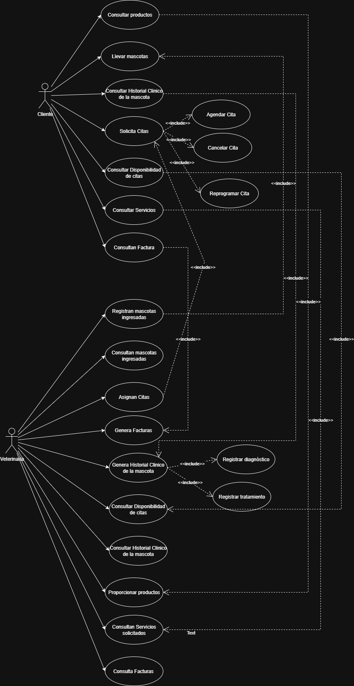
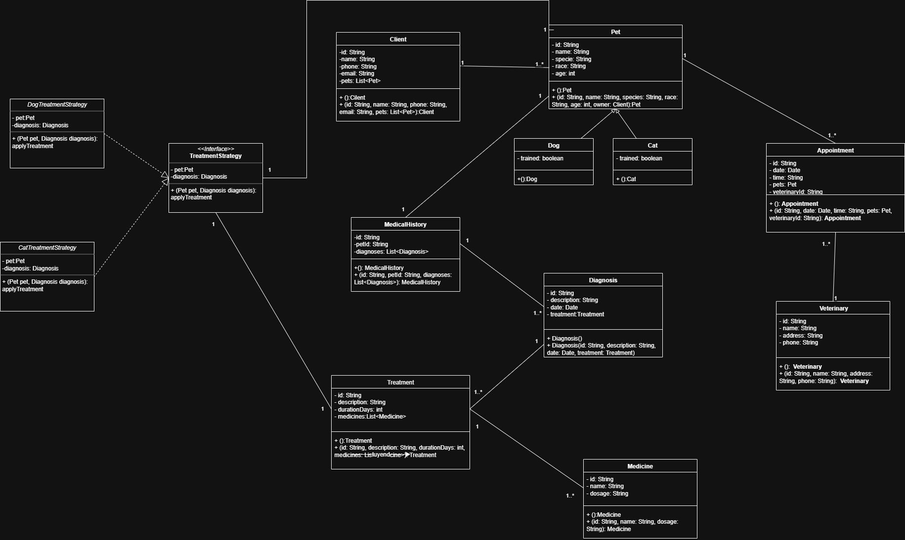

# EquipoAzul_PetCare-360
## Diagrama de contexto

## Diagrama de casos de Uso

## 📖 Historias de Usuario

###  Cliente

- Como **Cliente**, quiero consultar productos para conocer qué ofrece la veterinaria.
- Como **Cliente**, quiero llevar mis mascotas para que reciban atención médica.
- Como **Cliente**, quiero consultar el historial clínico de mi mascota para conocer diagnósticos y tratamientos anteriores.
- Como **Cliente**, quiero solicitar citas para que mi mascota reciba atención en un horario definido.
- Como **Cliente**, quiero agendar una cita para asegurar un espacio en la veterinaria.
- Como **Cliente**, quiero cancelar una cita para liberar el espacio si no puedo asistir.
- Como **Cliente**, quiero reprogramar una cita para elegir una nueva fecha si surge un imprevisto.
- Como **Cliente**, quiero consultar la disponibilidad de citas para seleccionar una fecha y hora adecuada.
- Como **Cliente**, quiero consultar los servicios disponibles para saber qué atención puede recibir mi mascota.
- Como **Cliente**, quiero consultar mi factura para conocer los pagos pendientes o realizados.

---

### Veterinaria

- Como **Veterinaria**, quiero registrar mascotas ingresadas para llevar un control de los animales atendidos.
- Como **Veterinaria**, quiero consultar mascotas ingresadas para verificar la información registrada.
- Como **Veterinaria**, quiero asignar citas para organizar la atención de los clientes.
- Como **Veterinaria**, quiero generar facturas para registrar los pagos de los servicios prestados.
- Como **Veterinaria**, quiero generar el historial clínico de la mascota para documentar diagnósticos y tratamientos.
- Como **Veterinaria**, quiero registrar un diagnóstico para dejar constancia del estado de salud de la mascota.
- Como **Veterinaria**, quiero registrar un tratamiento para indicar los pasos a seguir en la recuperación de la mascota.
- Como **Veterinaria**, quiero consultar la disponibilidad de citas para gestionar la agenda de atención.
- Como **Veterinaria**, quiero consultar el historial clínico de la mascota para dar seguimiento a su estado de salud.
- Como **Veterinaria**, quiero proporcionar productos para cubrir las necesidades del cliente y la mascota.
- Como **Veterinaria**, quiero consultar los servicios solicitados para verificar la atención prestada.
- Como **Veterinaria**, quiero consultar facturas para llevar el control contable.

## Diagrama de clases

## Patrones de Diseño aplicados

- **Factory Method**  
  Usado para crear diferentes tipos de mascotas mediante una clase llamada `PetFactory`.

- **Builder**  
  Utilizado para la construcción de objetos complejos como `MedicalRecord` (Historial Clínico) que contiene múltiples `Diagnosis` y `Treatment`.

- **Strategy**  
  Implementado en el manejo de tratamientos o diagnósticos, que pueden variar según la especie del animal.

- **Singleton**  
  Aplicado en la clase `Veterinary`, si el modelo representa una única instancia global de la clínica.

---

##  Principios SOLID en el diseño

- **S – Single Responsibility Principle (SRP)**  
  Cada clase tiene una única responsabilidad dentro del dominio.  
  *Ejemplo:* `PetFactory` solo crea mascotas, no las registra ni las trata.

- **O – Open/Closed Principle (OCP)**  
  Las clases están cerradas para modificación pero abiertas para extensión.  
  *Ejemplo:* se pueden agregar nuevos tipos de mascotas sin modificar la lógica existente en `PetFactory`.

- **L – Liskov Substitution Principle (LSP)**  
  Las subclases deben comportarse como su superclase sin alterar la funcionalidad del sistema.  
  *Ejemplo:* `Dog extends Pet` y `Cat extends Pet` funcionan de manera consistente como `Pet`.

- **I – Interface Segregation Principle (ISP)**  
  Cada interfaz define solo lo necesario, sin obligar a implementar métodos inútiles.  
  *Ejemplo:* cada `TreatmentStrategy` implementa su propia interfaz sin heredar métodos que no aplica.

- **D – Dependency Inversion Principle (DIP)**  
  El código del dominio depende de abstracciones y no de implementaciones concretas.  
  *Ejemplo:* los servicios trabajan sobre interfaces de repositorio y estrategias de tratamiento, no sobre clases fijas.
---